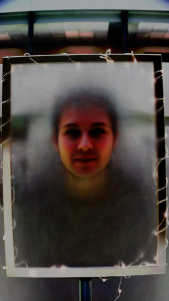

# The Face of the Crowd

An interactive installation for the [2019 ArtSci
exhibition](https://artsci.ethz.ch/) at the ETH in Zürich based on
facial recognition.  A portrait screen shows a face generated from
pictures taken from visitors of the exhibition.

The displayed images over time, each frame is a merge picture of the
last 7 faces.

## Motivation

The project was created specifically for the [ArtSci
exhibition](https://artsci.ethz.ch/) 2019, with the theme "An
exhibition celebrating the intersection of art and science through the
artistic expression(s) and communication of science."

As a computer science student, I wanted to convey the feeling of magic
that is sometimes created by technology.  Even if the individual parts
are well understood, the results can sometimes be surprising.

## Exhibition Setup

At the exhibition, the setup consisted of a large ~ 40" screen in
portrait mode, and next to it a small picture frame prompting people
to put their face in the frame.  Behind the frame was a camera
pointing on the frame.  The camera triggered when a face was in the
frame.  When the camera takes a picture a sound is played to indicate
that a picture was taken.

The screen shows a merged face based on the last pictures taken (at
the ArtSci exhibition the last 5 pictures were used).  The merging is
based on 68 facial landmarks positioned around the eyes, the eyebrows,
the nose, the mouth and chin.  Each landmark position is morphed
towards the average positon for that landmark, calculated from all
pictures.  In this way the individual pictures are morphed together,
forming the face of the crowd.

This is the image generated from merging all the pictures taken over
the course of the exhibition.

## Main Resources Used

- OpenCV
- [face_recognition](https://github.com/ageitgey/face_recognition)
- [average face generation](https://www.learnopencv.com/average-face-opencv-c-python-tutorial/)
- [handling landmarks](https://www.learnopencv.com/face-morph-using-opencv-cpp-python/)

## Licensing

This project uses a sound from freesound: `bing.wav`, originally
[buttonchime02up.wav](https://freesound.org/people/JustinBW/sounds/80921/),
created by *JustinBW*.

The project is licensed unter the MIT license.
